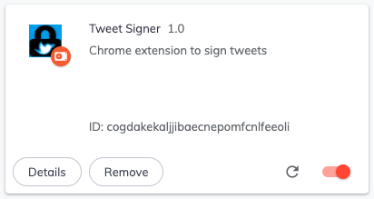
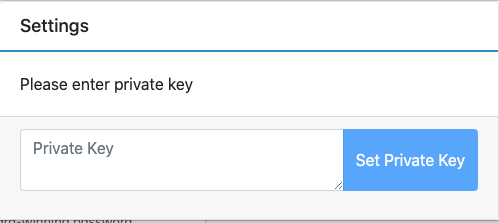
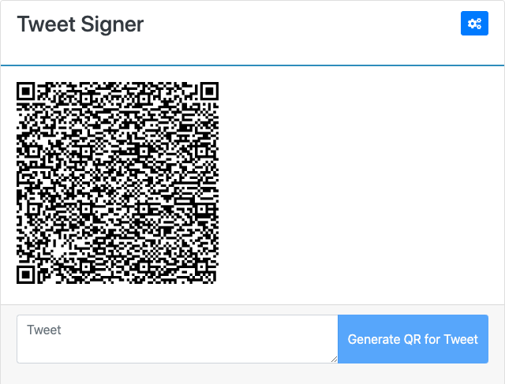

Tweet Signer:
=============

What is it?
------------

A way for you to cryptographically sign tweets, and for others to verify it.

Signed and verified Tweets ✌

Spec:
-----

* Add a link to your profile bio ending with '.keys' which should be a valid
  public key.

* In case .keys contains multiple keys, the first key will be used.

* A tweet which needs verification must contain exactly one image attachment
  which should be the signature of the tweet as a QR code.

* The signature must be verifiable against the tweet using the public key from
  the profile.

Why does this exist?
----------------------

"Not Your Keys, Not Your Coin" is a oft-repeated adage. 
Exchanges get hacked - but nobody thought Twitter would get hacked, until they did. 

You need to be abale to sign your tweets, so even if Twitter gets hacked again, people can verify that the tweet did not come from you.    

How does it work?
--------------------

- You install our chrome extension.
- You store your private key in the chrome extension. The private key is only stored locally and never leaves your computer.
- You write the tweet in the chrome extension
- The extension generates the signature and the QR code for the signature
- You view and downloads the QR code
- You attach the QR code to the tweet. Your tweet is now signed. Anyone can verify the sanctity of your tweet. Even if twitter posting get compromised, nobody can tweet a signed tweet on your behalf. 

Loading the chrome extension
-------------------------------

In the `chrome-extension` directory look for the folder => `final-extension`. Follow the steps to below to add the extension to chrome.

1. Open chrome://extensions/ in the chrome browser

2. Enable developer mode by button on the top right 

3. Click on load unpack button on top left and select the `final-extension` folder

4. It will load our chrome extension like below

 

5. Enter a private key in settings to get started

6. Type in the tweet to generate QR Code

Usage:
-------------

- Install the chrome extension
- Add a private key to the extension
- Host the public key somewhere and add public key url to your profile
- Generate the signature QR code for your tweet and attach it to the tweet

To verify
-------------

- Go to https://nitter.tuxcanfly.me/
- Paste the url of a tweet you want to verify
- If the tweet is signed, aka has the QR code, it is checked against the tweet contents. If the signature matches, the tweet is marked as verified.
  

LICENSE:
------------

MIT
